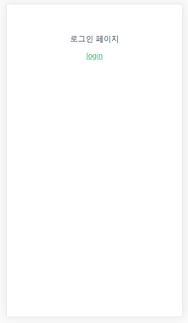
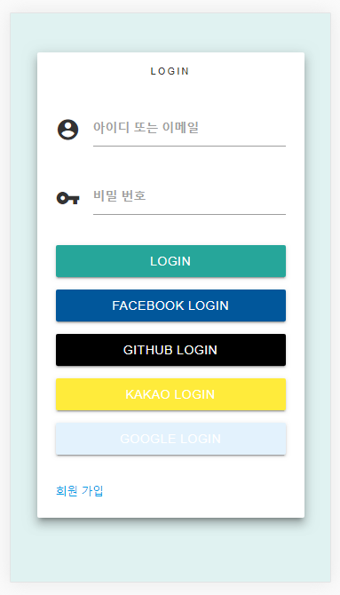
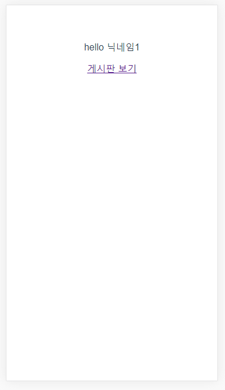
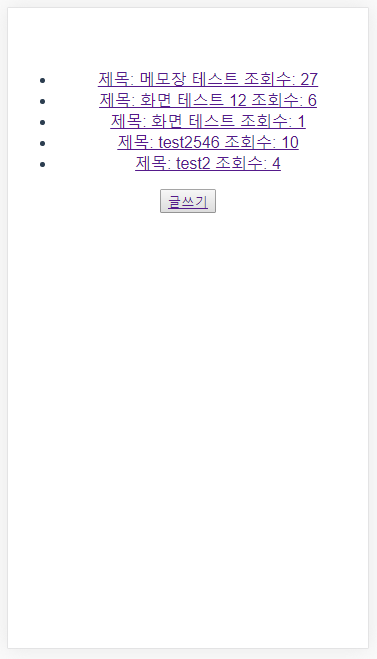
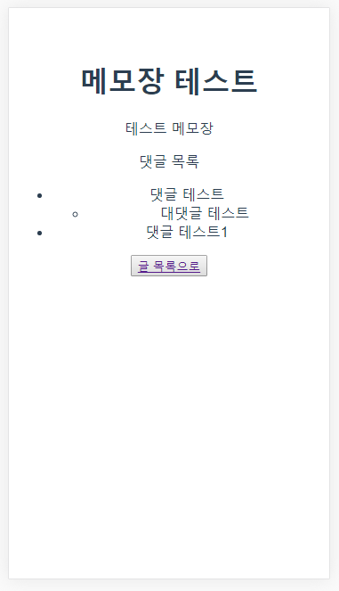
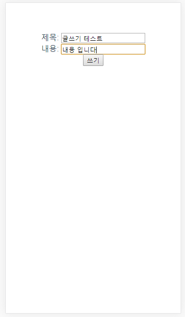
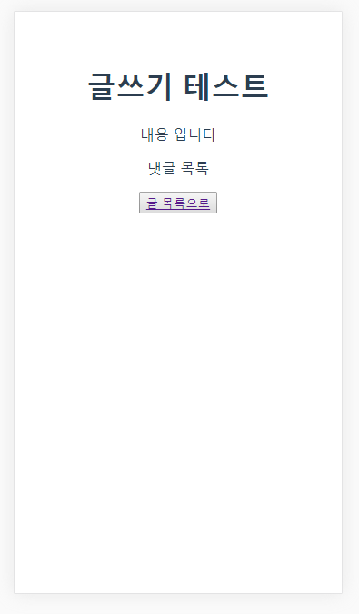
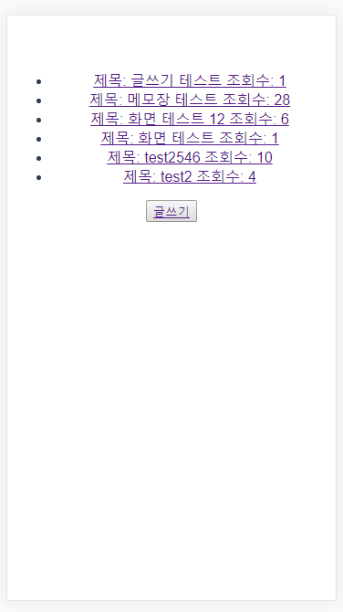

첫 화면 입니다 

로그인을 누를시 noteAuthorizeServer로 리다이렉트 됩니다.

noteAuthorizeServer에서 로그인 성공 시 noteAuthorizeServer에서 다시 noteClient로 리다이렉트됩니다
noteClient로 리다이렉트 되면서 code값을넘겨 주고 받아온 code값으로 access_token을 발급 받습니다.
발급 받은 access_token으로 noteServer에 회원 정보를 요청 하여 받아 옵니다.

게시판으로 이동시 작성한 게시글 목록이 보입니다(서버에서는 페이징 처리가 되어있으나 아직 클라이언트에서 페이징 처리 구현이 안되어 있습니다)

게시글 클릭시 해당 게시글의 내용과 댓글이 보이게 됩니다.

글쓰기 클릭시 게시글을 작성 할 수 있습니다

게시글을 작성시 작성한 게시글 내용을 보여 줍니다.

작성한 게시글이 저장되어 있는 것을 확인 할 수 있습니다.